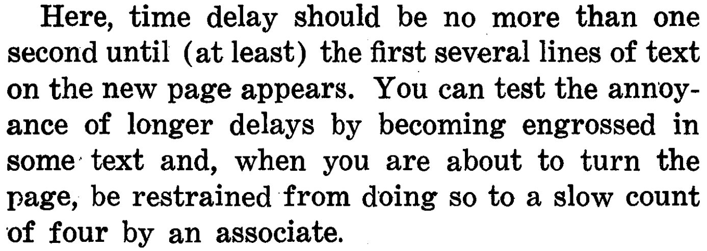
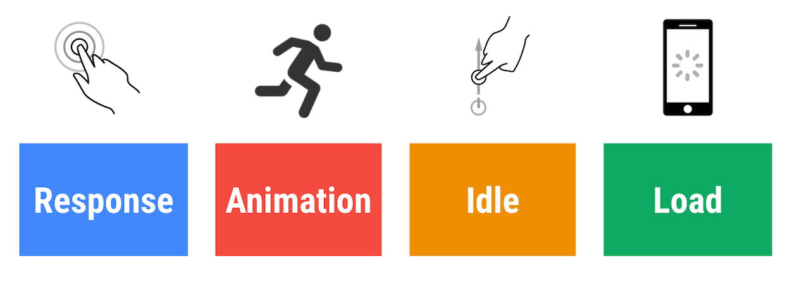
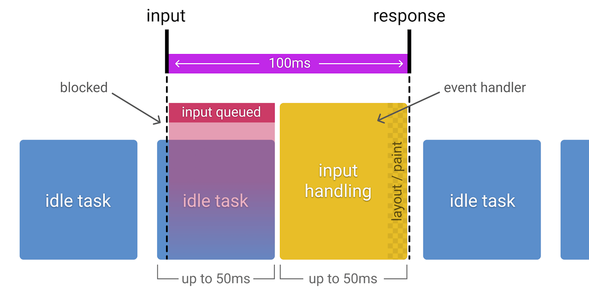
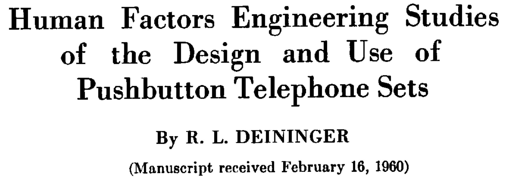
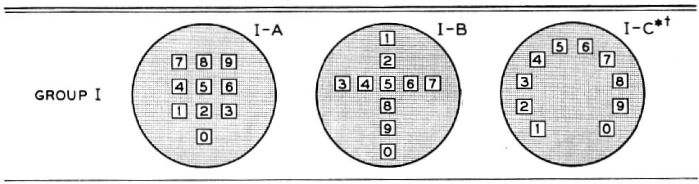
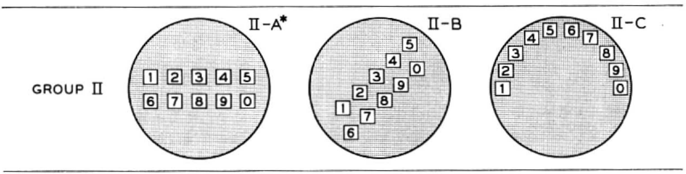
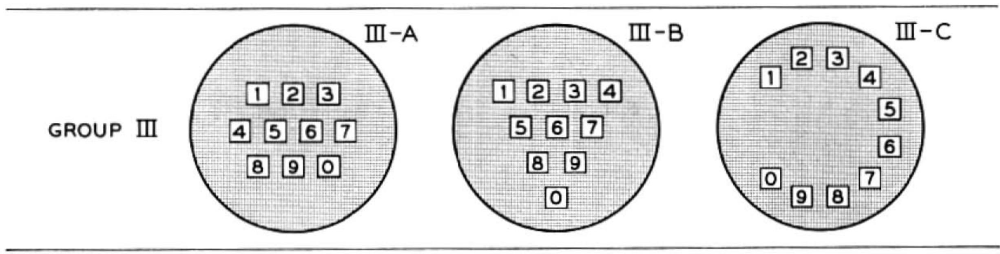
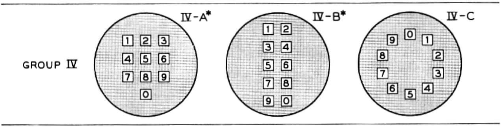
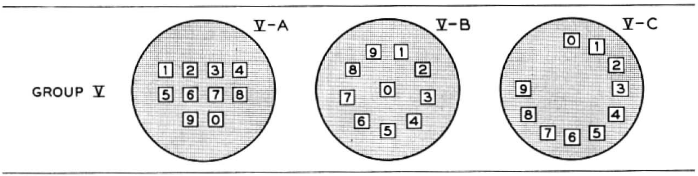
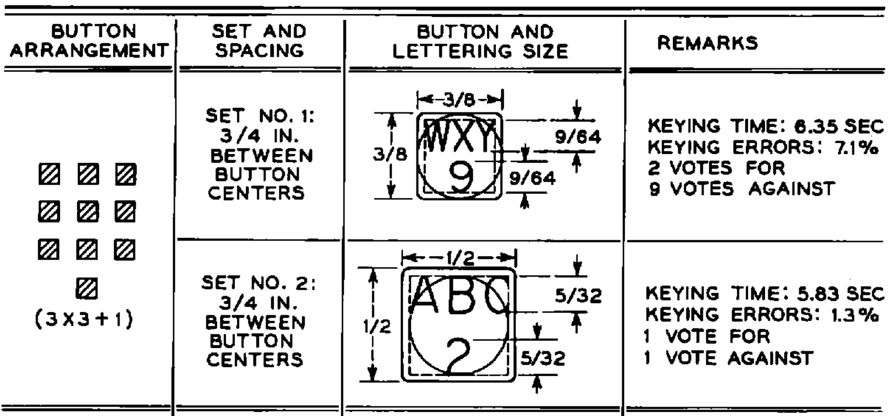

<!-- npx reveal-md ./slides.md -->

# Data-driven UX

Core Web Vitals und das Rail performance Model

-v-

Moin 👋

Ich bin Jakob,  
und manchmal mache ich 1 WebDev.

-v-

Es gibt da dann ja so Komplexitäten, mit Software

- im Problem das wir lösen wollen
- in Browsern
- in der UI

-v-

Komplextät ist immer mal sehr verlockend.

(Wir denken uns dann was)

-v-

Angenehm kann dann auch sein

- eine gute Lösung zu bauen
- UI, die schwuppt
- Software, die Leute gerne benutzen

---

## UX

-v-

> The **user experience** (UX) is how a user interacts with and experiences a product, system or service …

[en.wikipedia.org/wiki/User_experience](https://en.wikipedia.org/wiki/User_experience)

> a user’s perceptions and responses that result from the use and/or anticipated use …

[ISO 9241](https://en.wikipedia.org/wiki/ISO_9241)

-v-

Ganz schöner Themenkomplex.

-v-

Wir gucken uns nur ein paar Aspekte an,  
Google tut da was:

- Core Web Vitals
- Das Rail performance model

-v-

Wir gucken uns nicht an:

- Viele Sachen
- A11y, aria, reduced-motion, high-contrast / low-contrast

-v-

### Hot take 🌶️

- Gute UX passiert nicht einfach so
- Es reicht nicht aus, auf Gutes zu hoffen
- Gute Software hat Methode
- Messen und Verbessern von Mängeln
- Engineering culture

---

## Response times

(Die für Menschen)

-v-

-v-

### Viel inhalt

- Activity clumping
- Psychological closure
- Stepdown discontinuities bei Verzögerungen
- Ratschläge für unterschiedliche Scenarien
  - Response to simply inquiry of listed information

-v-

### Next page

-v-

Empfehlungen, Beispiele:

- Zeit bis zum Signalton am Telefon
- Frustrationen bei Interaktion mit textbasierten Interfaces
- Nebenläufige Prozesse - in 1h oder 1t ist ~egal

-v-

Viele Vermutungen, wenig Messungen

Behauptung, Miller 1968:
(Reaktions-)Zeiten sind allgemeingültig, verändern sich wenig

---

### Nielsen Norman Group

Jakob Nielsen: Usability Engineering, 1993

[www.nngroup.com/../response-times-3-important-limits/](https://www.nngroup.com/articles/response-times-3-important-limits/)

-v-

#### Obere Grenzen

- 0.1s um eine Reaktion als Sofort wahrzunehmen
- 1s für einen ununterbrochenen Gedankenfluss
- 10s für die Aufmerksamkeit

-v-

Nach wie vor Grundlage für viele Interfaces

Davon wurde auch ein spezifisches Performancebudget abgeleitet,
das RAIL Modell.

---

## Das Rail modell

[web.dev/rail](https://web.dev/rail/)

-v-

### Response

- 💭: 0.1s Budget
  - 100ms
- Klicks, Tastendrücke und sowas

-v-

-v-

### Animation

- 💭: 0.1s Budget
- Zeit für JS pro Frame: 100ms/60 -> 16ms
  - 6ms für Rendering
  - <= 10 ms für JS

-v-

### Idle

- 💭: Idlezeit maximieren
- In der Idlezeit angestaute Arbeit erledigen
- Arbeit auf 50ms Blöcke beschränken

-v-

### Load

- 💭: 1s, 10s Limits
- <= 5s zum initialen Laden der Seite
- <= 2s für weitere loads

-v-

### Fokus auf user

- Daten von Nutzenden in Betracht ziehen.
- Tunnel in Brandenburg?

---

-v-

-v-

-v-

-v-

-v-

-v-

-v-

-v-

-v-

Datenerhebung:

- Korrektheit der Eingaben
- Eingabegeschwindigkeiten
- Ratschläge/Ansichten der Testenden in Textform

---

## Web vitals

Lab data & field data

[web.dev/vitals](https://web.dev/vitals/)

-v-

Ableiten von Web Vitals

Unterschied zwischen Lab Data und RUM
Was ist der Zugewinn durch RUM?

-v-

Was wird sich von diesen Metriken erhofft?

- Von Google
- Von Leuten, die Websites bauen
- Von Nutzenden

-v-

LCP - Largest Contentful Paint

Wie lange dauert es, die größte, initial sichtbare Fläche zu rendern?
Wir interessieren uns für das p75 der Messungen.

Kontext:
Das größte initiale Element - gleich ob Bild oder Text - einer Seite trägt den wichtigsten Inhalt.
Warten auf wichtige Inhalte ist frustrierend.

-v-

FID - First Input Delay

Wie lange ist die Verzögerung zwischen dem Auslösen der ersten Interaktion
  mit einer Seite und einer darauf folgenden Reaktion?
Wir interessieren uns für das p75 der Messungen.

Kontext:
Gerade Seiten mit JavaScript können besondere Verzögerungen bei Interaktionen haben.
Langsamere Verbindungen sind eine zusätzliche Last.
Initaler Delay -> ggf. passiert noch besonders viel zum Laden von Seitenteilen.

-v-

CLS

---

A draft on how to measure

sendBeacon
How to with Fastly
In case of Cloudflare just change the CDN ;)
S3 or similar

---

// We start with some introduction

The topic is big -> we only talk about aspects

UX is a big word and lots of things can be meant by it and included with it.
What does it mean for us here?

What are we focussing on?

- Stuff done by Google
- Core Web Vitals
- Rail model

Maybe: what are we leaving out of scope?
A11y aria reduced-motion high-contrast low-contrast

What are implications?

- For Google
- For the Web
- For users

CTA
Good stuff is not an accident
Good websites are engineered
Good engineering has a culture

---

Web Vitals
[web.dev/vitals](https://web.dev/vitals/)

What is the aim?
How is data gathered?
What is real-user data vs. lab data?

-v-

LCP FID CLS ..

UI patterns / anti-patterns

Demo of recording web vitals
Demo of measuring performance in Chrome

---

RAIL model
[web.dev/rail](https://web.dev/rail/)

Why have a performance model?
The idea of a budget that is derived from measured numbers.

---

- ⏱️ Lasst mal Dinge messen!
- 🚀 Lasst mal ungünstige Messungen besser machen!

Weil wir Software mögen und so 🤗

- Slides: [github.com/runjak/nook2022](https://github.com/runjak/nook2022)
- Website: [runjak.codes](https://www.runjak.codes/)
