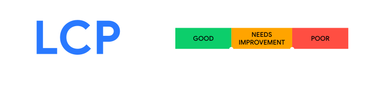
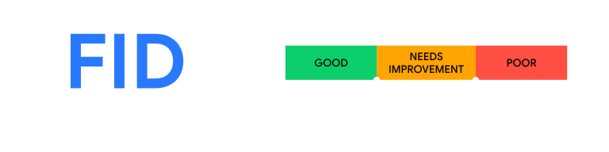
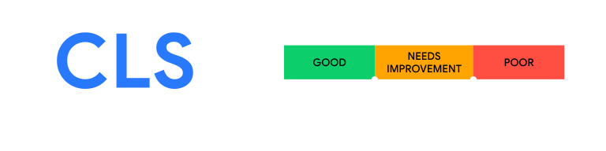

<!-- npx reveal-md ./slides.md -->

# Data-driven UX

Core Web Vitals und das Rail performance Model

-v-

Moin 👋

Ich bin Jakob,  
und manchmal mache ich 1 WebDev.

- Hab ne Website: [runjak.codes](https://www.runjak.codes/)
- Gibt Slides: [github.com/runjak/nook2022](https://github.com/runjak/nook2022)

-v-

Es gibt da dann ja so Komplexitäten, mit Software

- im Problem das wir lösen wollen
- in Browsern
- in der UI

-v-

Komplextät ist immer mal sehr verlockend.

(Wir denken uns dann was)

-v-

Angenehm kann dann auch sein

- eine gute Lösung zu bauen
- UI, die schwuppt
- Software, die Leute gerne benutzen

---

## UX

-v-

> The **user experience** (UX) is how a user interacts with
> and experiences a product, system or service …

[en.wikipedia.org/wiki/User_experience](https://en.wikipedia.org/wiki/User_experience)

-v-

> a user’s perceptions and responses that result
> from the use and/or anticipated use …

[ISO 9241](https://en.wikipedia.org/wiki/ISO_9241)

-v-

Ganz schöner Themenkomplex.

-v-

Wir gucken uns nur ein paar Aspekte an,  
Google tut da was:

- Das Rail performance Modell
- Core Web Vitals

-v-

Wir gucken uns nicht an:

- A11y, aria
- reduced-motion
- high-contrast / low-contrast
- Viele Sachen

-v-

### Hot take 🌶️

- Gute UX passiert nicht einfach so
- Es reicht nicht aus, auf Gutes zu hoffen
- Gute Software hat Methode
- Messen und Verbessern von Mängeln
- Engineering culture

---

## Response times

(Die für Menschen)

-v-

-v-

### Viel inhalt

- Activity clumping
- Psychological closure
- Stepdown discontinuities bei Verzögerungen
- Ratschläge für unterschiedliche Scenarien
  - Response to simply inquiry of listed information

-v-

### Next page

-v-

Beispiele:

- Zeit bis zum Signalton am Telefon
- Frustrationen bei Interaktion mit textbasierten Interfaces
- Nebenläufige Prozesse - in 1h oder 1t ist ~egal

-v-

### Behauptung

(Reaktions-)Zeiten verändern sich wenig

-> Empfehlungen

---

## Nielsen Norman Group

Jakob Nielsen: Usability Engineering, 1993

[www.nngroup.com/../response-times-3-important-limits/](https://www.nngroup.com/articles/response-times-3-important-limits/)

-v-

### Obere Grenzen

- 0.1s um eine Reaktion als Sofort wahrzunehmen
- 1s für einen ununterbrochenen Gedankenfluss
- 10s für die Aufmerksamkeit

-v-

Nach wie vor Grundlage für viele Interfaces

Davon wurde auch ein spezifisches Performancebudget abgeleitet,
das RAIL Modell.

---

## Das Rail modell

[web.dev/rail](https://web.dev/rail/)

-v-

### Idle

- 💭: Idlezeit maximieren
- In der Idlezeit angestaute Arbeit erledigen
- Arbeit auf 50ms Blöcke beschränken

-v-

### Response

- 💭: 0.1s Budget
  - 100ms
- Klicks, Tastendrücke und sowas

-v-

-v-

### Animation

- 💭: 0.1s Budget
- Zeit für JS pro Frame: 100ms/60 -> 16ms
  - 6ms für Rendering
  - <= 10 ms für JS

-v-

### Load

- 💭: 1s, 10s Limits
- <= 5s zum initialen Laden der Seite
- <= 2s für weitere loads

-v-

### Fokus auf user

- Daten von Nutzenden in Betracht ziehen.
- Tunnel in Brandenburg?

---

-v-

-v-

-v-

-v-

-v-

-v-

-v-

-v-

-v-

Datenerhebung:

- Korrektheit der Eingaben
- Eingabegeschwindigkeiten
- Ratschläge/Ansichten der Testenden in Textform

---

## Web vitals

[web.dev/vitals](https://web.dev/vitals/)

-v-

- Lab data
- Field data
- p75

-v-

### Wer erhofft sich hier was?

- User
- WebDevs
- Google

-v-

[web.dev/lcp](https://web.dev/lcp/)

-v-

#### Largest contentful pait (LCP)

- Größtes Element -> wichtigster Inhalt
- Bild, Video, Text, ..

-v-

[web.dev/fid](https://web.dev/fid/)

-v-

#### First input delay (FID)

- Verzögerungen stören
- JavaScript 💪🤬
- Langsame Verbindungen / viele Daten?

-v-

[web.dev/cls](https://web.dev/cls/)

-v-

#### Cumulative Layout Shift (CLS)

- Verschiebungen ohne Interaktion
- Verschiebungsscores
- Summe über einen Zeitraum

-v-

#### Kurzes Ranten

- Karusselle
- Notifications, die reingeschoben werden
- Automatisches Erneuern von Inhalten
- Bilder, Fonts
- …

-v-

Es gibt da ne Sammlung von guten Patterns

[web.dev/patterns/web-vitals-patterns](https://web.dev/patterns/web-vitals-patterns/)

---

## Messen

So, hier - wie messen wir das nun?

-v-

- [Chrome UX Report](https://developer.chrome.com/docs/crux/)
- Begrenzt mit Lighthouse
- Selbst nachgucken (DevTools)
- Selbst sammeln

-v-

### Selbst Messungen sammeln

- [npmjs.com/package/web-vitals](https://www.npmjs.com/package/web-vitals)
- [Navigator.sendBeacon](https://developer.mozilla.org/en-US/docs/Web/API/Navigator/sendBeacon)
- Aggregation im Backend

-v-

#### Datenspaarsamkeit

- Messwert
- Seitentyp, Route oder sowas
- Deviceklasse

---

- Lasst mal messen ⏱️
- Lasst mal verbessern 🚀

Weil wir Software mögen und so 🤗
